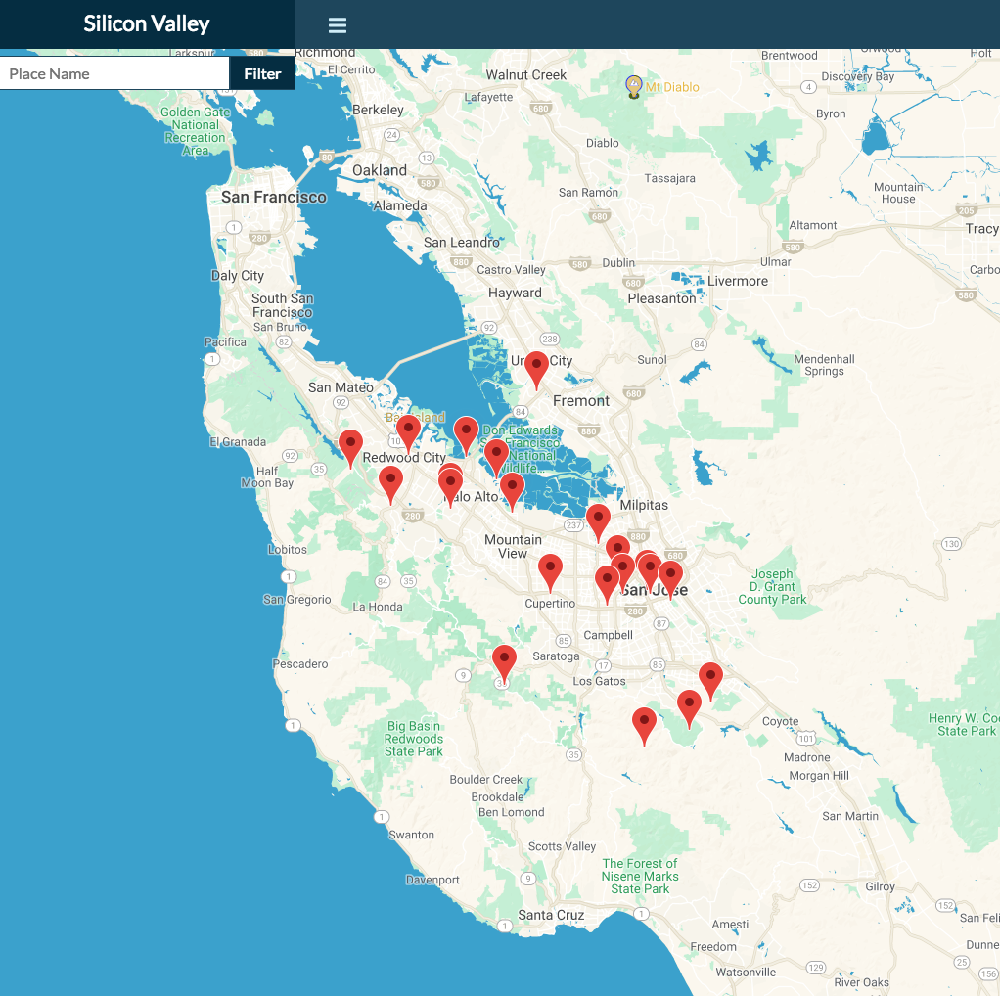

# Neighborhood Map Project React

	

This is the **Udacity Neighborhood Map Project**. It's intended as a challenge to put together a website from various APIs. This includes making function calls to Google Maps to get the map and locations details. Furthermore, ratings and reviews are retrieved from Yelp Fusion.

Included is a list of atrractions in Silicon Valley that visitors should stop by.

The app allows you to filter the list down as you type. In return, it displays the locations on the map.

This application follow this [Udacity Project Rubric](https://review.udacity.com/#!/rubrics/1351/view)

## Run Online Project

Click the link following https://romklao.github.io/neighborhood_map/ to see the webpage.

## Features

1. Click on any marker to see the location details retrieved from the [Google Map API](https://developers.google.com/places/web-service/get-api-key) and reviews retrieved from [Yelp Fusion API](https://www.yelp.com/developers/documentation/v3).
2. Search through availaible locations.
3. Get information on locations from the search or through marker click.

## Installing

The project uses [Create-React-App starter code](https://github.com/facebookincubator/create-react-app) on a [Node.js >= 6](https://nodejs.org/en/) environment

Follow these steps:

1. Install node from the link above.
2. Clone this repository to your computer `git clone https://github.com/romklao/neighborhood_map.git`
3. In `src folder` create Config.js file:

   - `touch Config.js`
   - `atom Config.js`

4. In the Config file, enter your Yelp API keys in an object like so (naming them whatever you like, and putting the keys in as strings). You don't need any other code in this file:

      `const config = {
        headers: {'Authorization': 'Bearer  <Your Yelp API Key>'}
       }`

    - Note: Keep space between Bearer and your API key.

5. Install all the dependencies with `npm install`
6. Launch the app with this command `npm start`

The app will launch in your browser at the address[http://localhost:3000/](http://localhost:3000/).

## Build

You can run the build for testing the service worker or any other reason following these steps:

1. First `npm run build` to create an optimized version of the project.
2. Then `npm run deploy` to deploy to the specified address.

